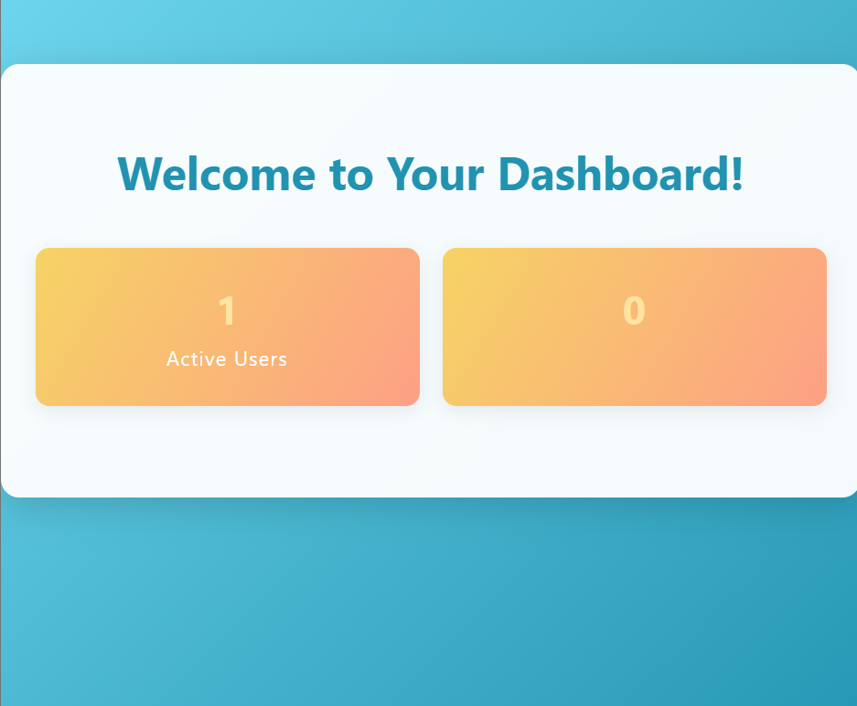

# Registration Backend

A user registration and login system built with Express.js, EJS, and PostgreSQL.

---

## Screenshots

- Registration Page:
  
- Login Page:
  
- Dashboard:
  

---

## Features

- User registration with validation
- Secure password hashing (bcryptjs)
- Login with email or username
- Session-based authentication
- Dashboard with dynamic active user count
- Logout functionality
- Beautiful EJS templates for UI

## Technologies Used

- Node.js
- Express.js
- express-session
- express-validator
- bcryptjs
- EJS
- PostgreSQL (`pg`)

## Setup Instructions

1. **Clone the repository**
   ```bash
   git clone https://github.com/coded-by-diksha/registration-backend.git
   cd registration-backend
   ```

2. **Install dependencies**
   ```bash
   npm install
   ```

3. **Configure the database**
   - Create a PostgreSQL database.
   - Create a table named `register` with columns: `id`, `username`, `email`, `password`, `status`.
   - Update `config/database.js` with your database credentials.

4. **Run the server**
   ```bash
   npm run dev
   ```
   The app will run on [http://localhost:3000](http://localhost:3000).

## Folder Structure

```
registration-backend/
├── app.js
├── package.json
├── config/
│   └── database.js
├── controllers/
│   └── auth.js
├── middleware/
│   └── authmiddleware.js
├── models/
│   └── Users.js
├── routes/
│   └── authRoutes.js
├── views/
│   ├── dashboard.ejs
│   ├── login.ejs
│   └── register.ejs
├── screenshots/
│   ├── registration.png
│   ├── login.png
│   └── dashboard.png
```

## Usage

- Register a new user at `/register`
- Log in at `/login` (using email or username)
- Access the dashboard at `/dashboard`
- Log out via the dashboard

## License

MIT

---


